## mongodb の作成

https://www.mongodb.com/cloud/atlas/mongodb-google-cloud

- メールアドレス・名前・苗字・パスワードを入力
- 規約に同意にチェック
- 「Get Started Free」をクリック

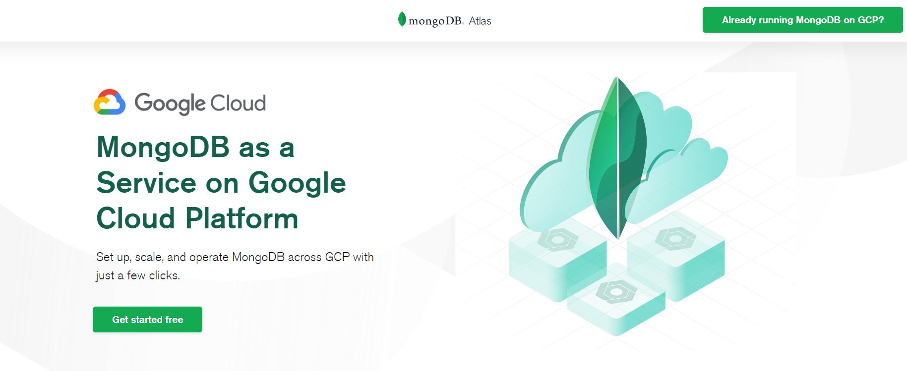
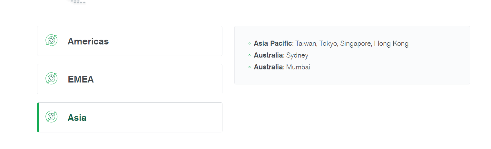
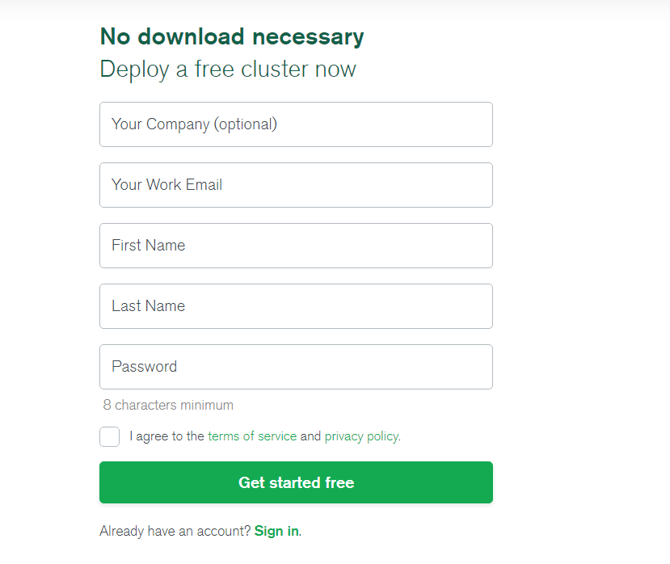
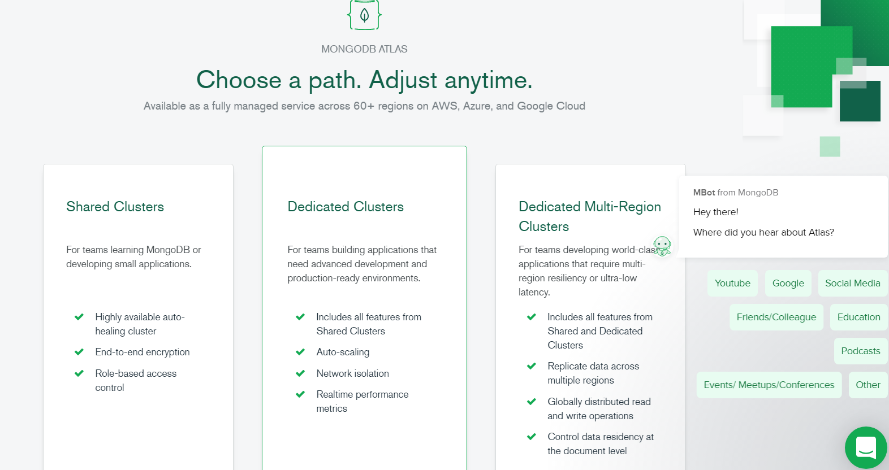

- 無料プランを作成

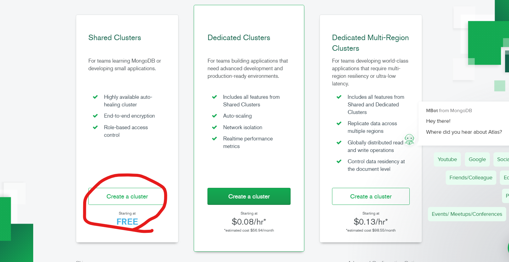

- Google Clound Platform を選択
- TOkyo リージョンを選択
- Create Cluster をクリック
  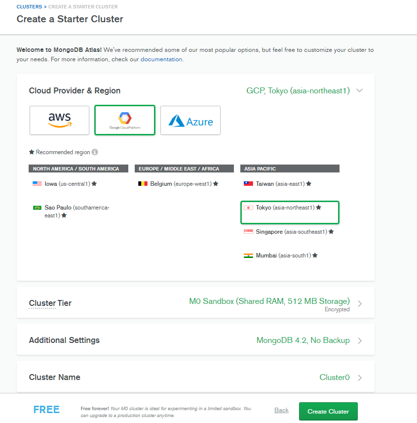

- 作成されたクラスタを確認。
  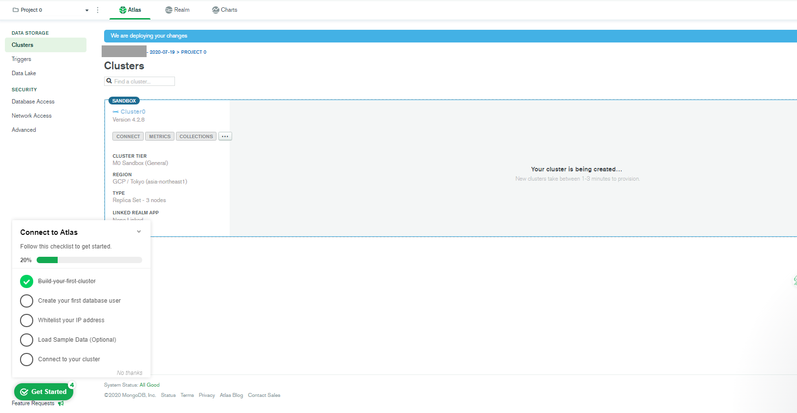

## ホワイトリスト登録・ユーザ登録

- Create a New Cluster をクリック
  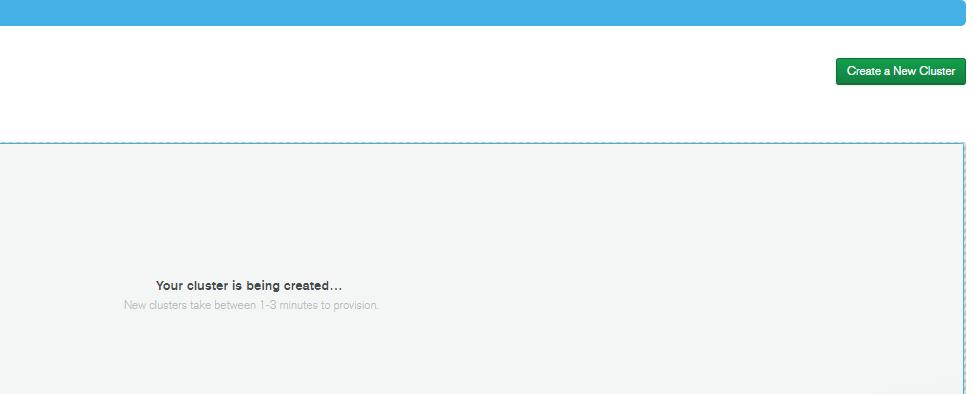

- Connect をクリック
  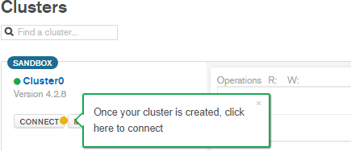
  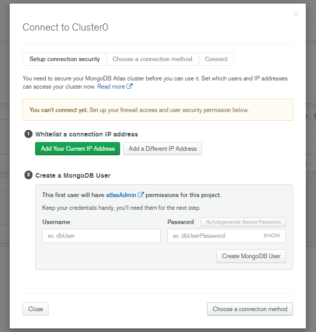
- WhiteList に IP を登録
- MongoDB のユーザを作成
  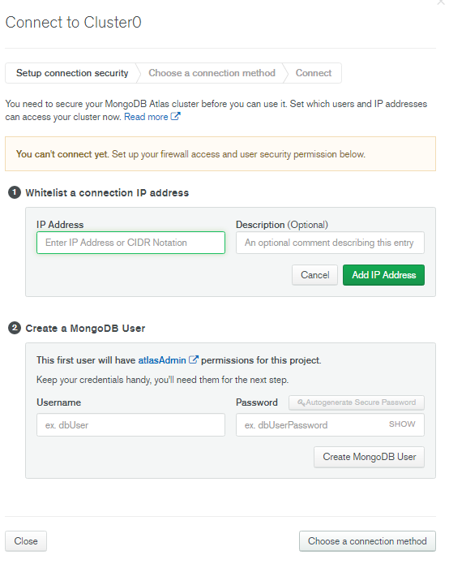
  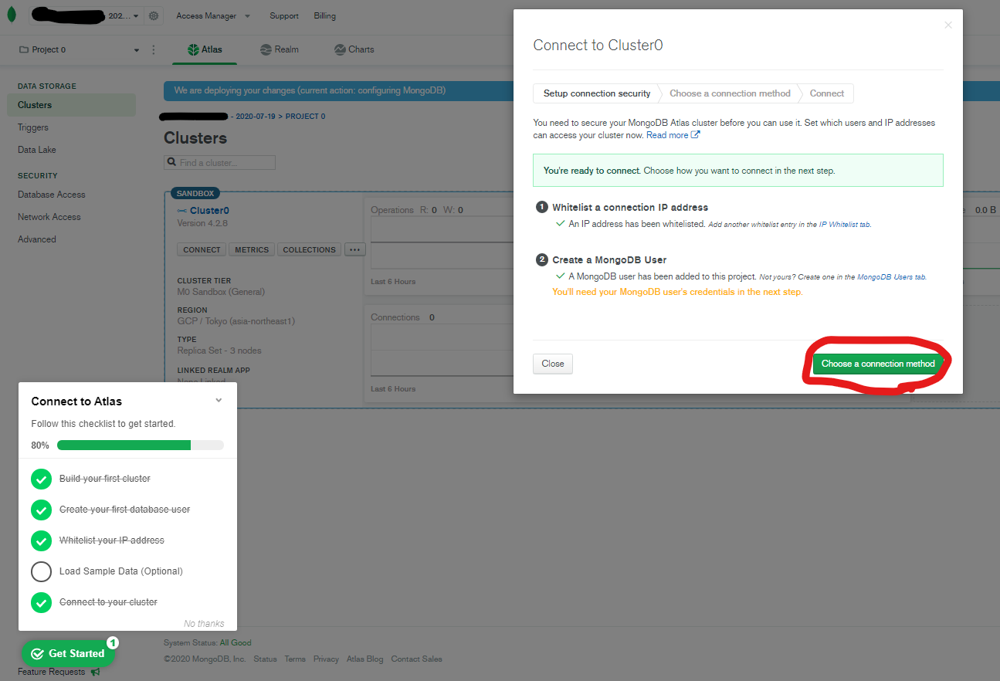

## データベース作成

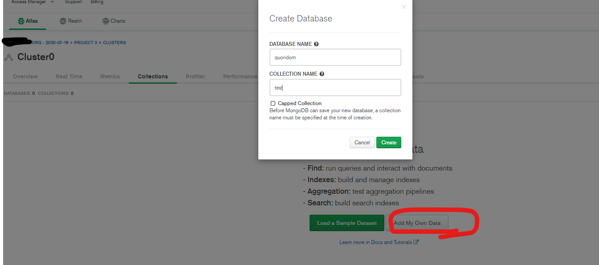

## windows での接続確認方法

- 接続方法の確認
  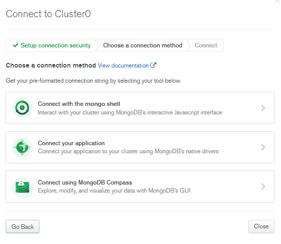
  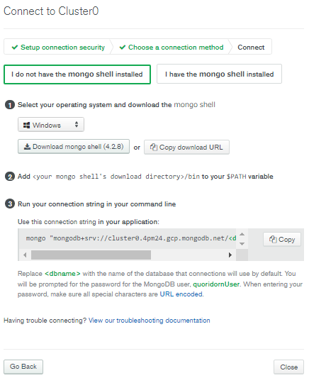

powershell の管理者モードで、mongo のシェルをインストール

```ps
choco install mongodb -y
```

パスを通す。
`C:\Program Files\MongoDB\Server\4.2\bin`に mongo はインストールされている。
環境変数の Path にここのフォルダへのパスを追加する。
最新のバージョンによって違うかもしれないので、インストールされるバージョンはよく見ておくこと。

- 接続のテスト

```ps
mongo "mongodb+srv://<hoge>.gcp.mongodb.net/<dbname>" --username <fuga>
```

## 参考

[MongoDB Atlas で無料で簡単にクラスタ化する](https://qiita.com/ka_nabell_dev/items/0e91ae7646ddc78e514f)
[deploy free tier cluster](https://docs.atlas.mongodb.com/tutorial/deploy-free-tier-cluster/)
[MongoDB 基礎：DB 接続の書き方](https://qiita.com/chenglin/items/ecf6f67e8f80c4750204)
