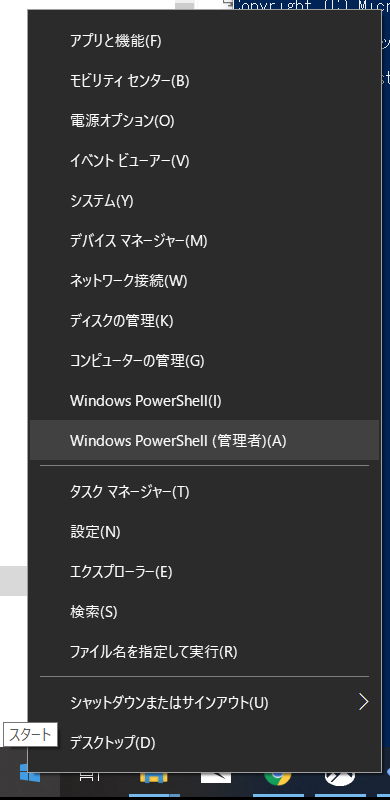
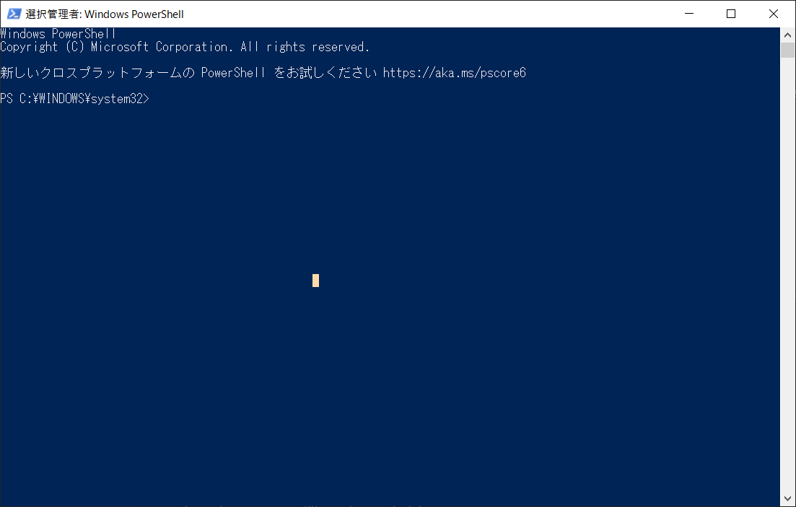
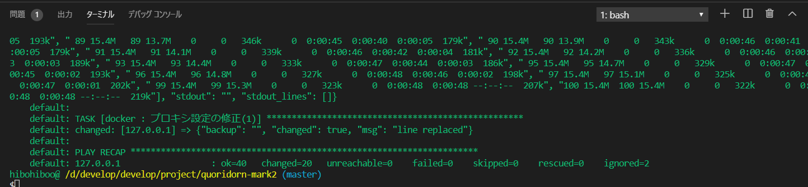
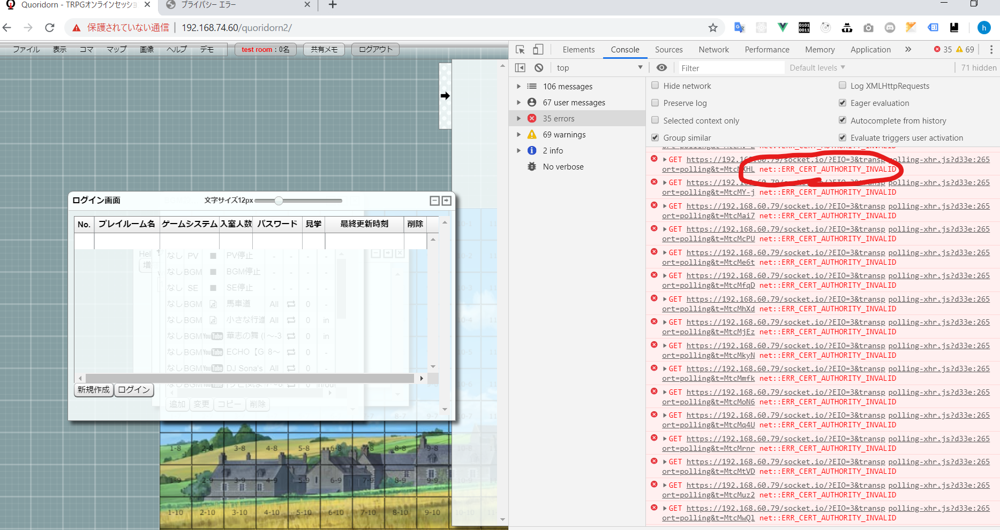
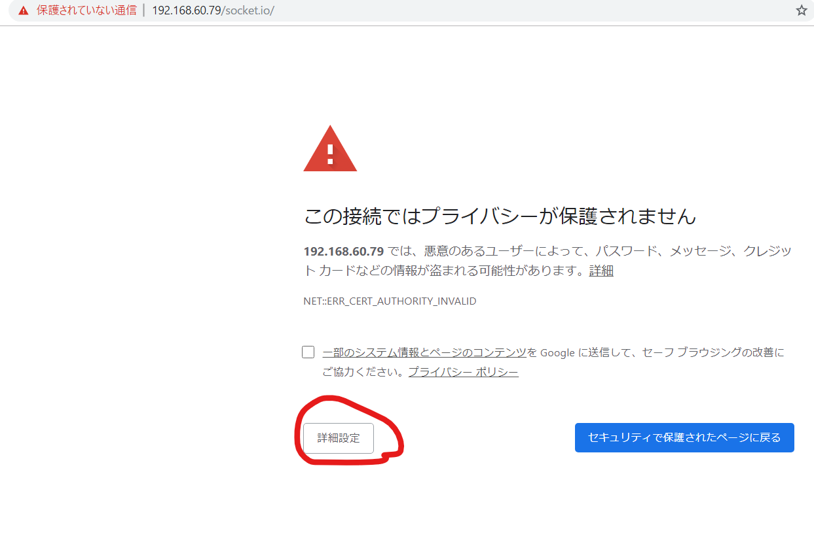
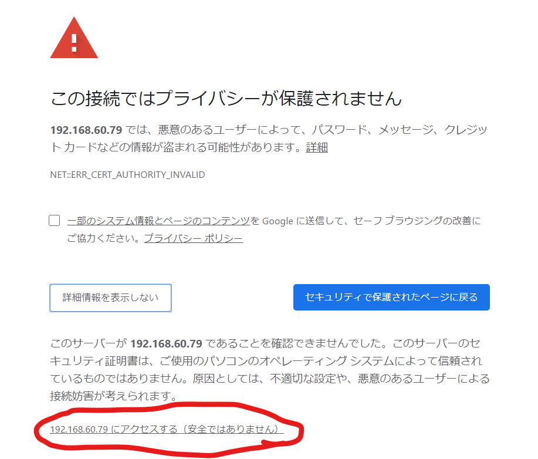
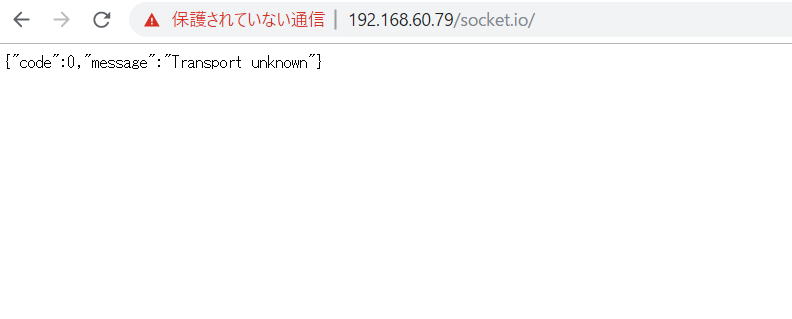
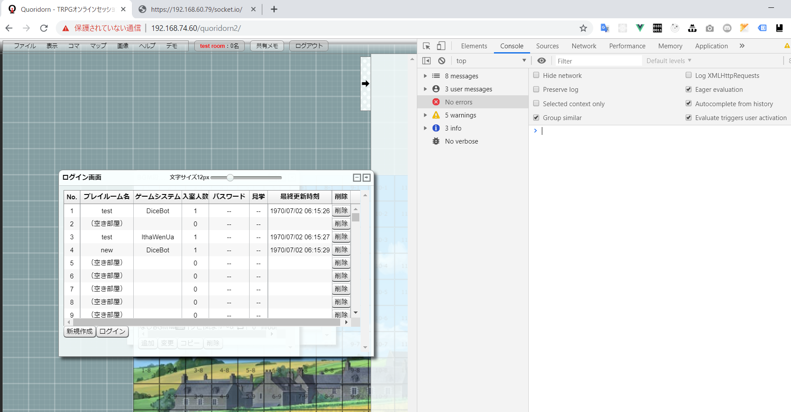

# 仮想環境設定メモ

## 手順

### 1. chocolatey のインストール

#### 1-1. PowerShell を開く

Windows のコンソールである Power Shell を管理者権限で開く。
スタートボタンの上にマウスを合わせて右クリックでスタートコマンドが開くので、「Windows PowerShell(管理者)(A)」を選択。
もしくは、[win]+[x]キー,[a]をキーボードで入力。



すると、「このアプリがデバイスに変更を加えることを許可しますか？」とメッセージがでるので「はい」を選択。
以下のようなコンソールが表示され、入力できるようになる。



#### 1-2. インストール

コンソールに以下のコマンドを入力して[Enter]

```
Set-ExecutionPolicy Bypass -Scope Process -Force; iex ((New-Object System.Net.WebClient).DownloadString('https://chocolatey.org/install.ps1'))
```

### 2. git virtualbox vagrant のインストール

#### 2-1. git virtualbox vagrant のインストール

コンソールに以下のコマンドを入力して[Enter]

```
cinst -y git virtualbox vagrant
```

ダウンロードしてインストールしている旨の英語が流れていく。
止まっていたら、時々[Enter]キーを押してやるとよい。
終わったら windows を再起動する。

#### 2-2. vagrant のプラグインのインストール

```
vagrant plugin install vagrant-vbguest
```

### 3.1 git clone

cloneを行う

### 3.2 quoridornの設定ファイル修正
quoridornのREADME.mdの手順にしたがい、.exampleの末尾が入っているファイルを粛々とコピー＆リネーム。


### 4. vagrant up

clone したフォルダで、右クリックをして gitbash のコンソールを開く。
そこに以下のコマンドを入力。

```
vagrant up
```

2 回、「このアプリがデバイスに変更を加えることを許可しますか？」とメッセージがでるので、2 回とも「はい」を選択。
ここから、仮想環境の構築がはじまるのでコーヒーでも淹れて待つ。

失敗した場合、以下のコマンドを何度か繰り返して、failed=0 になるまで待つ。

```
vagrant provision
```



## 詳細

### インストールしたツールについて

- chocolatey ... windows のパッケージ管理システム
- git ... バージョン管理システム
- virtualbox ... 仮想環境作成システム
- vagrant ... 仮想環境の設定を簡単にしてくれるツール

### Vagrantfile について

- `vagrant ssh`コマンドで仮想環境のサーバ上にログインできる。
- 仮想環境上では/vagrant ディレクトリが、Vagrantfile の置かれているフォルダとなる。つまり、/vagrant/Vagrantfile のようになっている。
- docker で nginx が動いている。トラブルがあったときは、ここを確認するとよい。
  - `cd /vagrant/virtual-environment/provision/docker`で docker のディレクトリに移動
  - `docker-compose build`で docker コンテナのビルド確認
  - `docker-compose stop`で現在動いているコンテナの停止
  - `docker-compose up`で再起動。ログを確認。

### docker について

以下は LaraDock の dokcer 設定を持ってきている。

- mongo
- mongo-webui
- nginx
- minio

### 設定について

.env

```
### MONGOWEBUI ###############################################
MONGO_WEBUI_PORT=3000
MONGO_WEBUI_ROOT_URL=http://192.168.74.60
MONGO_WEBUI_MONGO_URL=mongodb://mongo:27017/quoridorn
MONGO_WEBUI_INSTALL_MONGO=false

### MINIO #################################################

MINIO_PORT=9000
```

MONGO_WEBUI_MONGO_URL の quoridorn が作成を期待する DB となる。

S3バケットのMINIOのポートを設定

### minioについて
最初に以下のURLにアクセスして、quoridornバケットを作成する。
ログイン時のaccess keyはaccessでsecretkeyはsecretkey（docker-compose.yml参照）
http://192.168.60.79:9000/minio/

### SSL について

テスト用にオレオレ証明書を使っているため、クライアントから接続しようとすると
`ERR_CERT_AUTHORITY_INVALID`のエラーがでて接続できない。



その場合、先に以下の URL をブラウザで開く。
https://192.168.60.79/socket.io/

詳細設定をクリック。



192.168.50.79 にアクセスする（安全ではありません）をクリック。
安全なのは自分が知ってる。



以下の画面が出れば成功。


クライアントの画面に戻って、ページの再読み込みを行う。



`ERR_CERT_AUTHORITY_INVALID`のエラーが消えて、プレイルームが表示できた！

## mongodb をみたい

以下の URL にアクセス
http://192.168.60.79:3000/

connect を選び、Host/Port を`mongo`、`27017`とし、
DatabaseName を`quoridorn-1-0-0a44`にして「Save」
接続して確認する。

## minioをみたい

以下のURLにアクセス
http://192.168.60.79:9000/minio/

## 参考

[chocolatey instration](https://chocolatey.org/docs/installation)
[laradock](https://github.com/laradock/laradock)
[Laradock の Nginx を SSL 化する](https://qiita.com/osakana9114/items/48fb03e51e23dd02871c)
[WSS が繋がらない](http://wiki.brekeke.jp/WSS-%E3%81%8C%E7%B9%8B%E3%81%8C%E3%82%89%E3%81%AA%E3%81%84)
[Nginx によるリバースプロキシの設定方法](https://qiita.com/schwarz471/items/9b44adfbec006eab60b0)
[websocket を使う際の意外な落とし穴](https://blog.mitsuruog.info/2012/10/websocket.html)
[socketi.io](https://socket.io/)
[node.js 超入門 ①node.js で web サーバを作ってみる](https://qiita.com/ritukiii/items/7f28554369d63eb373c3)
